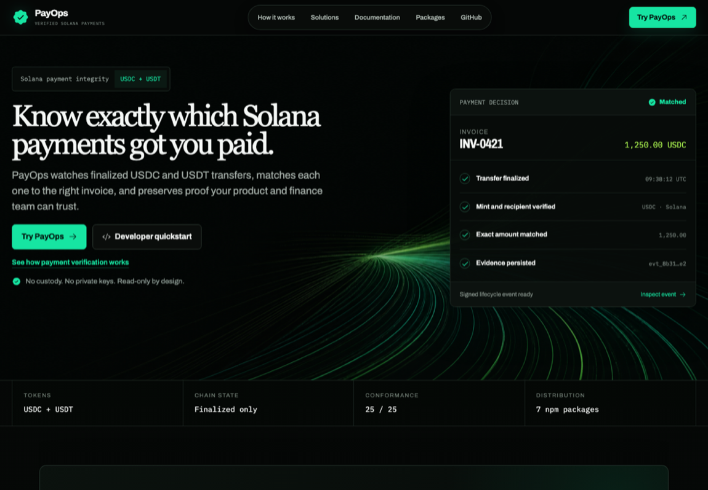
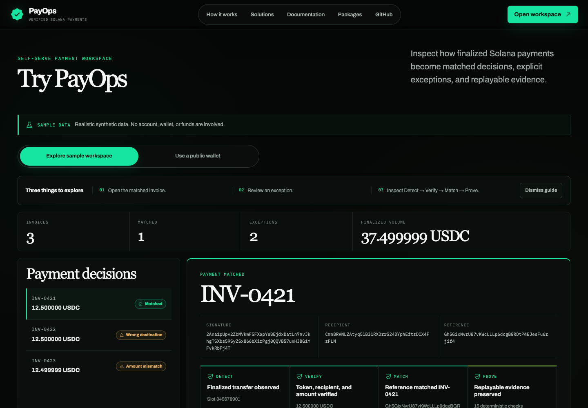
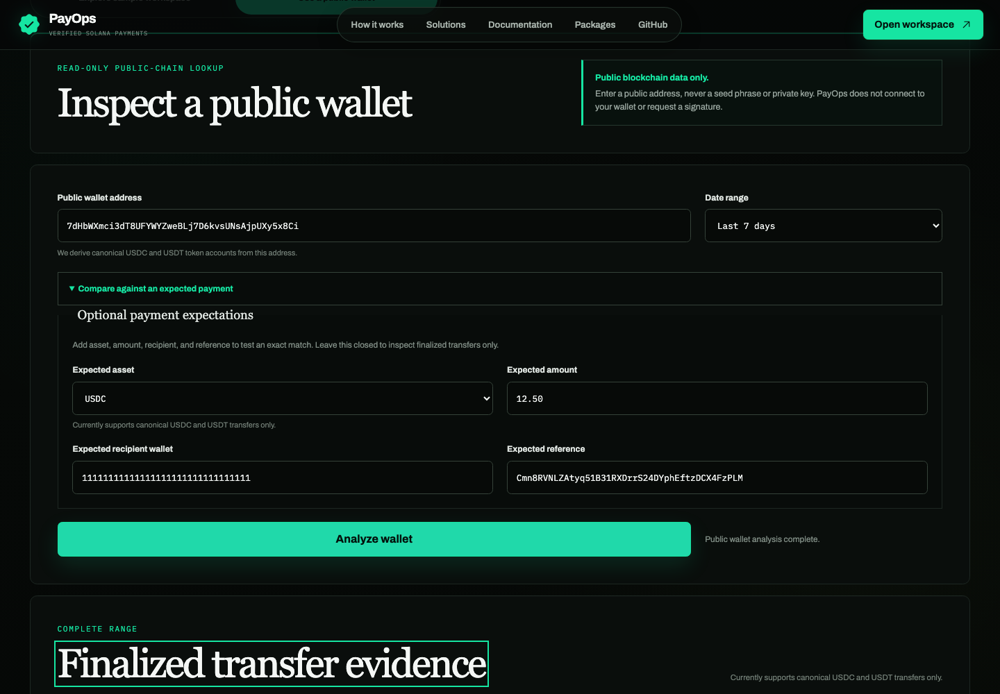
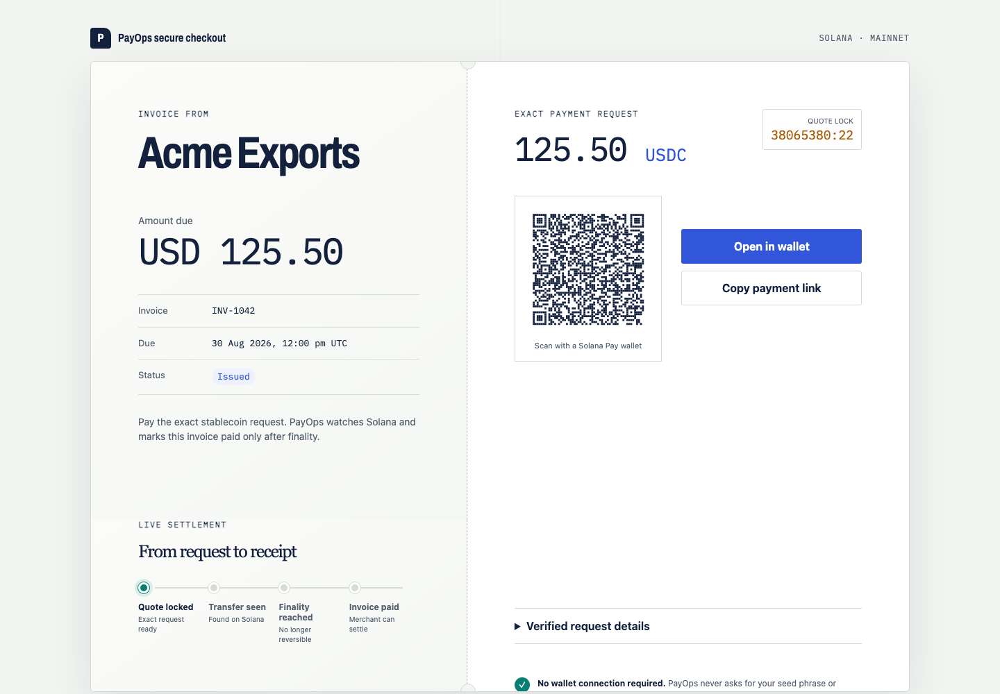
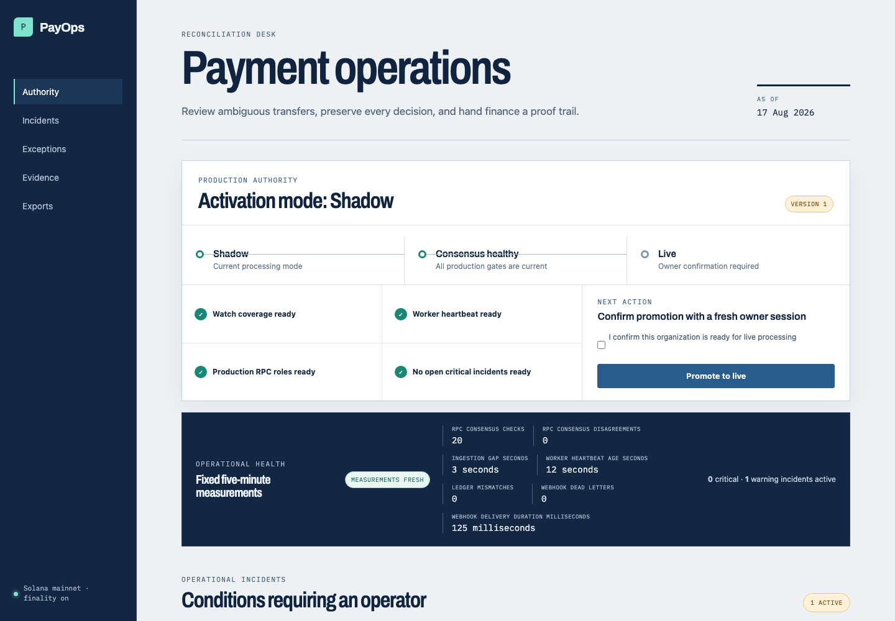
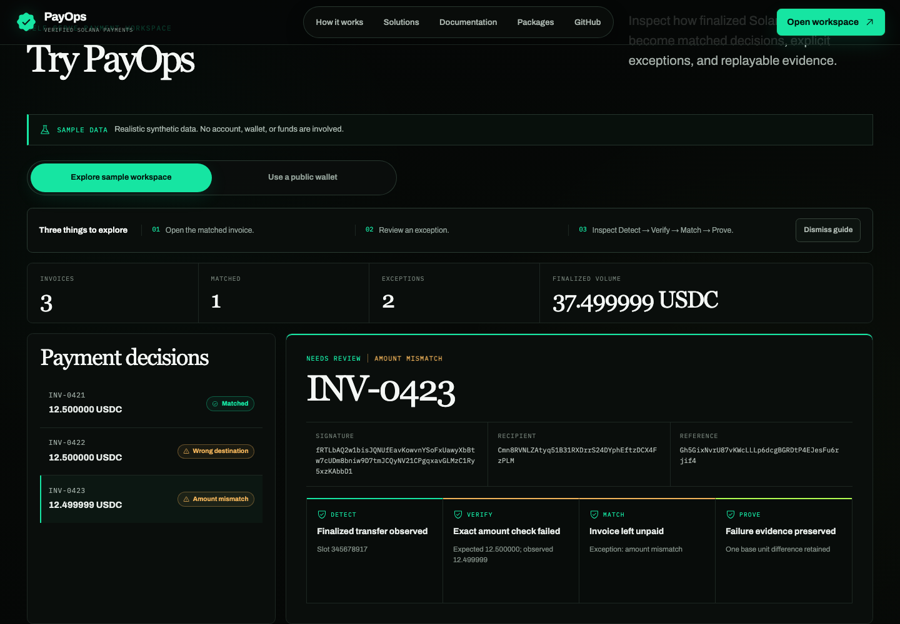
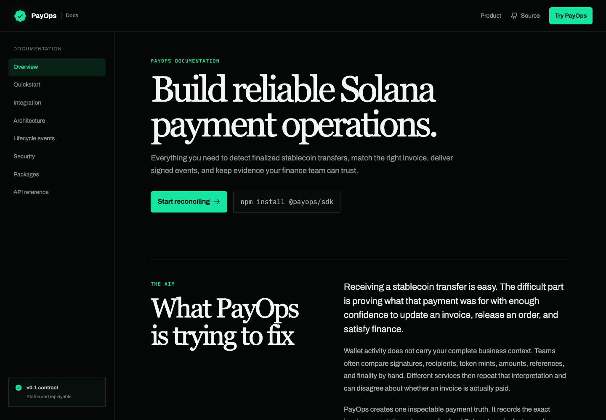
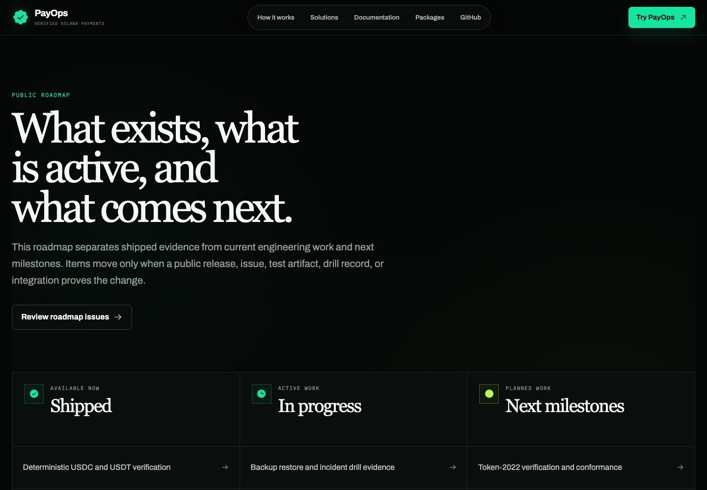

# PayOps project walkthrough

This walkthrough follows one payment from the product promise to its preserved
evidence, then shows the developer and operator surfaces behind it. Every image
comes from the local fixture-backed application at a 1440 by 1000 browser
viewport. The addresses, invoices, signatures, and amounts are synthetic.

## 1. The project promise

The homepage states the boundary before the feature list: PayOps watches
finalized USDC and USDT transfers, verifies the payment facts, matches the right
invoice, and preserves evidence. The Detect, Verify, Match, Prove model gives
merchant and developer teams one shared description of the decision path.

This page uses static product examples. PayOps does not custody funds or ask for
private keys.

## 2. Self-serve sample workspace

The sample workspace opens without an account. It contains one matched invoice,
one wrong-destination exception, and one amount-mismatch exception. Selecting a
decision exposes the observed transfer, expected payment facts, verification
checks, match result, and preserved proof.

This workspace uses realistic synthetic data. It does not connect a wallet or
move funds.

## 3. Read-only public wallet inspection

The public-wallet form accepts a public Solana address, optional recipient and
reference filters, an expected asset, and an exact amount. Results are bounded
to finalized USDC or USDT activity and distinguish complete analysis from an
explicitly partial result.

The form is read-only. It never requests a connection, signature, seed phrase,
or private key. This screenshot uses the local fixture response; a deployed
operator must enable the documented RPC, rate-limit, and readiness controls.

## 4. Merchant checkout

Hosted checkout presents the invoice, settlement asset, exact token amount,
recipient, reference, expiry, QR code, and copyable payment request. It keeps
the payment state observable while PayOps waits for finalized matching
evidence.

This screenshot uses the local checkout fixture. The production API creates and
signs the checkout token and fails closed when a safe quote cannot be produced.

## 5. Payment operations

The operations workspace combines invoices, reviewable exceptions, worker and
provider health, production-readiness facts, and authorized operator actions.
Controls stay tied to the authenticated role, and conflicting updates fail
without silently overwriting another operator's decision.

This screenshot uses the local operations fixture and synthetic incident data.

## 6. Replayable evidence

The evidence view keeps the invoice expectation, transfer identity,
verification checks, rule and parser versions, exception reason, and signed
lifecycle event traceable together. An operator can download the bounded
evidence and verification artifacts without reconstructing the decision from
logs.

This view uses a synthetic evidence pack served by the local fixture API.

## 7. Developer surface

The documentation covers the SDK quickstart, seven versioned npm packages,
REST API, lifecycle contracts, conformance fixtures, architecture, and security
boundaries. Developers can use the open-core packages independently or deploy
the complete API, worker, web, and migration stack.

The package source, generated contracts, examples, and release provenance are
public in this repository.

## 8. Roadmap and operating evidence

The roadmap separates shipped capabilities, active engineering work, and next
milestones. Items move only when a release, issue, test artifact, drill record,
or integration provides evidence.

The operating path is documented in the [deployment
runbook](../deploy/README.md), [backup-restore
checklist](../deploy/checklists/backup-restore.md), [incident
checklist](../deploy/checklists/incident.md), [dated recovery
records](../deploy/drills/), and [release process](../release/README.md). The
container smoke applies migrations twice, checks database-role separation,
restores a disposable backup, observes worker-readiness failure and recovery,
tests graceful shutdown, and removes its exact local resources.

## Reproduce the walkthrough

Run the fixture API and web application using the repository's Playwright
configuration, then open the routes shown above. The checkout token and all API
responses are deterministic fixtures under `apps/web/test/e2e/`. No external
account, paid service, personal wallet history, or production credential is
required.
